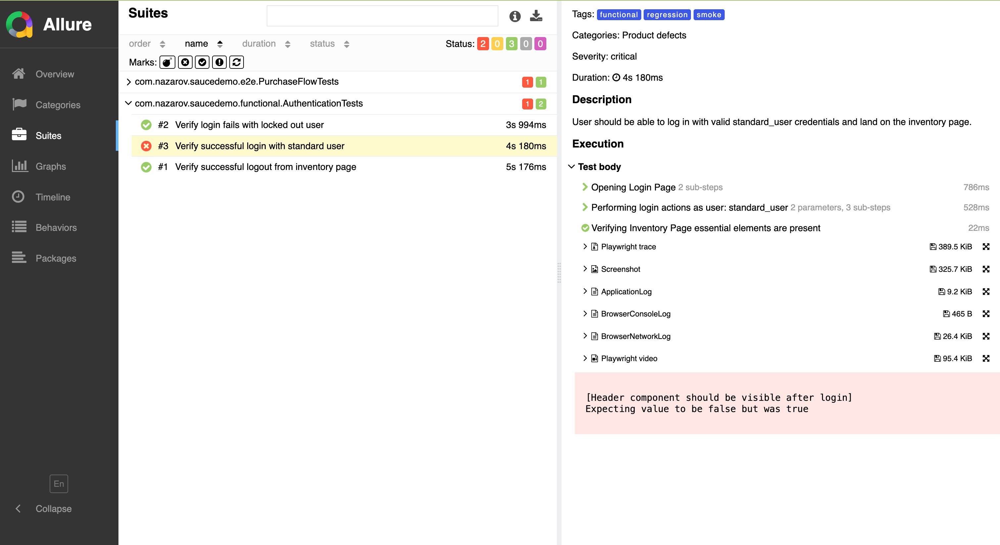

## General

Basic skeleton implementation of UI testing framework with Java + Playwright + Junit5 + Allure

## Technologies used

- JDK 17
- Maven 3.6

- [Playwright](https://playwright.dev/java/) - Testing Framework
- [jUnit5](https://junit.org/junit5/) - Jupiter - Test runner
- [Spring](https://spring.io/) - Dependency Injection
- [Allure](https://allurereport.org/) - reporting

## How to run tests

How to manipulate test configuration:

By default, configuration from the `resources/application-dev.properties` file will be used. If you
want to change config to `resources/application-qa.properties` just change the environment
variable `env=qa`

### With maven

Run from root folder:

```shell
mvn -f frontend-tests/pom.xml clean test -Denv=qa  
```

Run from `frontend-tests` folder:

```shell
mvn clean test -Denv=qa  
```

### With IDE(IntelliJ)

IDE test run configuration example:


## How to generate tests report

[Allure reports](https://allurereport.org/) is used for generating test reports

### With maven

```shell 
$ mvn allure:report
```

### With IDE(IntelliJ)


### Allure report attached details

- Full test run log is attached to every test case
- Screenshot is attached to every failed test case
- Video recording is attached to every failed test case



## Test and environment configurations

For an environment and test configuration following files are responsible. They can be found on
resources directories.

- Environment specific configuration, apis, url, db, etc.
    - application-dev.properties - dev environment configuration
    - application-qa.properties - dev environment configuration
    - application-XXXX.properties - by adding properties files with env name suffix (XXXX) there is
      possibility to run test against any environment by specifying -Denv=XXXX VM param
- allure.properties - configuration for Allure report, i.e. TMS links or results directory
- junit-platform.properties - junit configuration
- logback.xml - logger configuration with pattern and custom appender (see bellow)

### Parallel test execution

The design supports running tests in parallel. Just
set `junit.jupiter.execution.parallel.enabled=true` in `junit-platform.properties`
See [writing-tests-parallel-execution](https://junit.org/junit5/docs/snapshot/user-guide/#writing-tests-parallel-execution)
for advanced configuration

## Maven configuration

- All dependencies and their versions are managed by `dependencyManagment` of parent `pom.xml`
- In case of need to add new dependency add to `dependencyManagment` and then override it in
  specific module
- Same strategy applied to plugins
- All versions are kept in `properties` of parent `pom.xml`

### To check dependencies updates

* On dependencies
  ```shell
  $ mvn versions:display-dependency-updates
  ```

* On plugins
  ```shell
  $ mvn versions:display-plugin-updates
  ```
